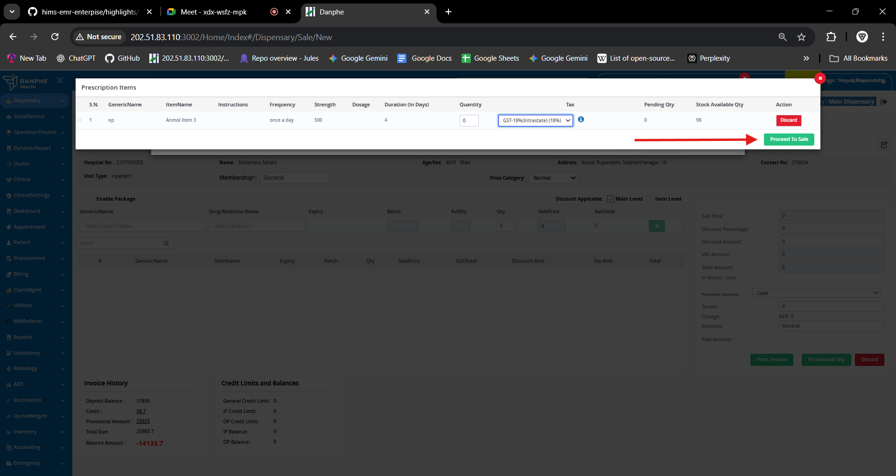

# Faster Dispensary Sales

[← Back to Release Notes](../README.md)

## Overview

The dispensary sales workflow has been streamlined, what was previously a two-step process into a single-click operation.

---

---

## Workflow

   1. After booking a petient appointment request medication for petient through clinical module
   2. Go to Dispensary module select the counter
   3. here search the patient name and the requested prescription will pop up
   4. just eneter the quantity and click Enter
   5. select tax details and then you can print invoice
